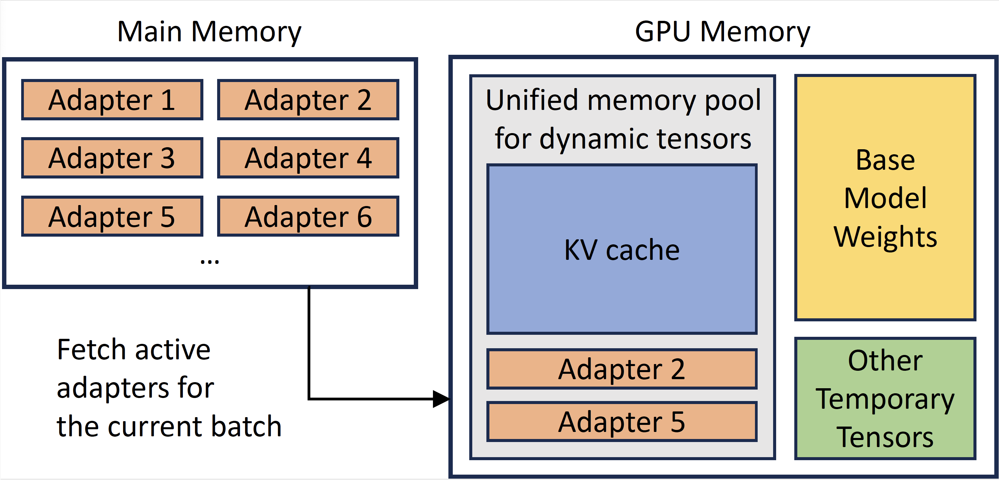
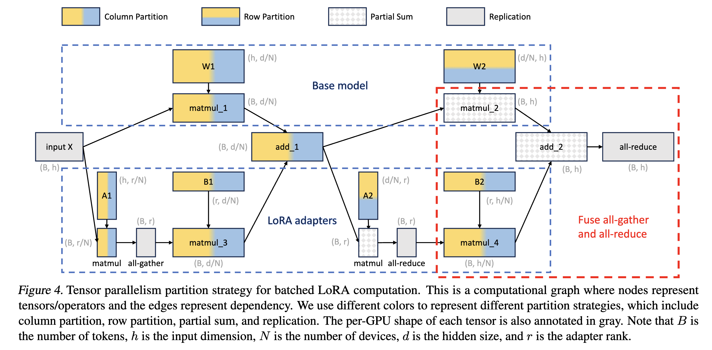
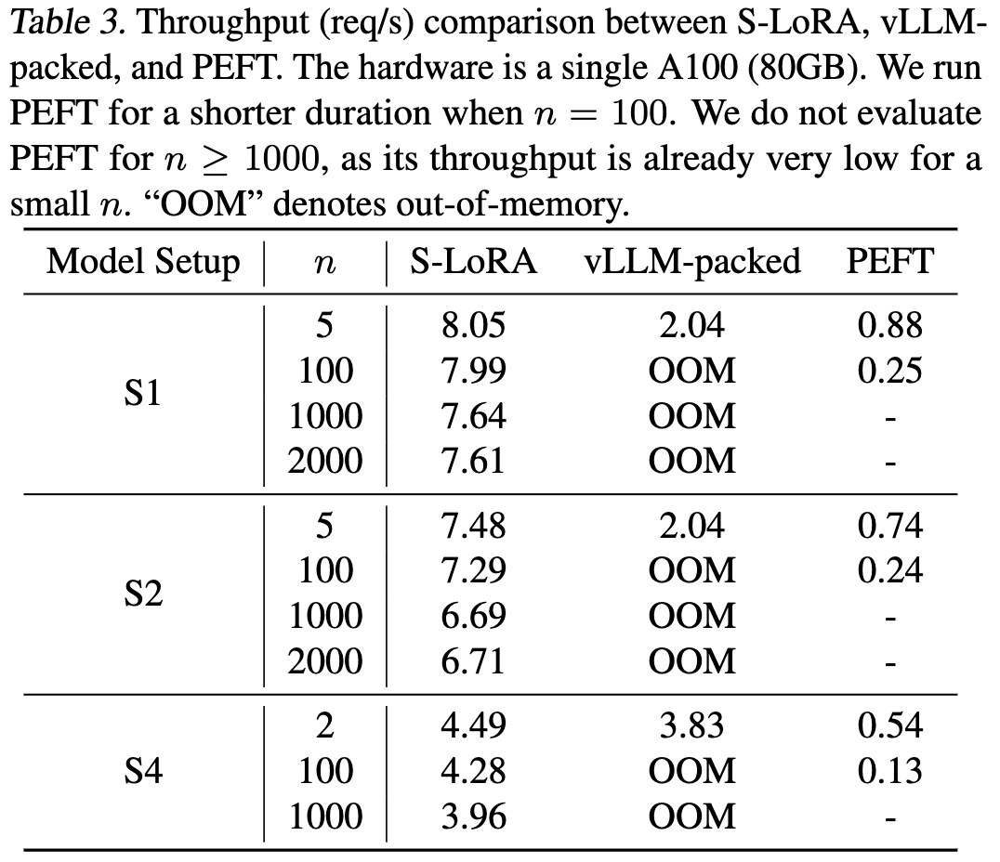
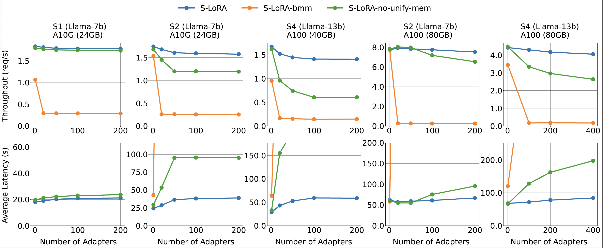
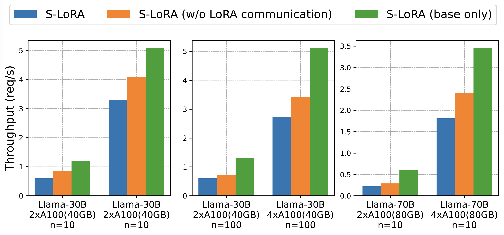

# S-LoRA: Serving Thousands of Concurrent LoRA Adapters [[paper](https://arxiv.org/abs/2311.03285)]

<p align="center">

</p>

## Abstract
The "pretrain-then-finetune" paradigm is commonly adopted in the deployment
of large language models. Low-Rank Adaptation (LoRA), a parameter-efficient
fine-tuning method, is often employed to adapt a base model to a multitude of
tasks, resulting in a substantial collection of LoRA adapters derived from one
base model. We observe that this paradigm presents significant opportunities
for batched inference during serving. To capitalize on these opportunities, we
present S-LoRA, a system designed for the scalable serving of many LoRA
adapters. S-LoRA stores all adapters in the main memory and fetches the
adapters used by the currently running queries to the GPU memory. To
efficiently use the GPU memory and reduce fragmentation, S-LoRA proposes
Unified Paging. Unified Paging uses a unified memory pool to manage dynamic
adapter weights with different ranks and KV cache tensors with varying sequence
lengths. Additionally, S-LoRA employs a novel tensor parallelism strategy and
highly optimized custom CUDA kernels for heterogeneous batching of LoRA
computation. Collectively, these features enable S-LoRA to serve thousands of
LoRA adapters on a single GPU or across multiple GPUs with a small overhead.
Compared to state-of-the-art libraries such as HuggingFace PEFT and vLLM (with
naive support of LoRA serving), S-LoRA can improve the throughput by up to 4
times and increase the number of served adapters by several orders of
magnitude. As a result, S-LoRA enables scalable serving of many task-specific
fine-tuned models and offers the potential for large-scale customized
fine-tuning services.

## Requirements
* CUDA 11.8
* PyTorch <= 2.0.1

## Installation
```
conda create -n slora python=3.9
conda activate slora
pip install torch==2.0.1
pip install -e .
```
Check that we have triton==2.1.0

## Example Run
Real model weights
```
cd benchmarks
python launch_server.py --num-adapter 100 --num-token 10000 --model-setting Real
python run_exp.py --debug --model-setting Real
```


Dummy weights
```
cd benchmarks
python launch_server.py --num-adapter 100 --num-token 10000 --dummy
python run_exp.py --debug
```

## Methods

- Unified Paging: To reduce memory fragmentation and increase batch size, S-LoRA introduces a unified memory pool. This pool manages dynamic adapter weights and KV cache tensors by a unified paging mechanism.

<p align="center">

</p>

- Heterogeneous Batching: To minimize the latency overhead when batching different adapters of varying ranks, S-LoRA employs highly optimized custom CUDA kernels. These kernels operate directly on non-contiguous memory and align with the memory pool design, facilitating efficient batched inference for added LoRA computation.

- S-LoRA TP: To ensure effective parallelization across multiple GPUs, S-LoRA introduces a novel tensor parallelism strategy. This approach incurs minimal communication cost for the added LoRA computation compared to that of the base model. This is realized by scheduling communications on small intermediate tensors and fusing them with the communications of the base model.

<p align="center">

</p>

## Evaluation

### Settings

Model Settings:
| Setting | Base model | Hidden size | Adapter ranks |
|---|---|---|---|
| S1 | Llama-7B | 4096 | {8} |
| S2 | Llama-7B | 4096 | {64, 32, 16, 8} |
| S4 | Llama-13B | 5120 | {64, 32, 16} |
| S5 | Llama-30B | 7168 | {32} |
| S6 | Llama-70B | 8192 | {64} |

Baselines:

PEFT stands for HuggingFace PEFT: We build a server using it that batches single adapter requests and switches adapter weights between batches.

vLLM-packed: Because vLLM does not support LoRA, we merge the LoRA weights into the base model and serve the multiple versions of the merged weights separately. To serve m LoRA adapters, we run m vLLM workers on a single GPU, where multiple workers are separate processes managed by NVIDIA MPS.

S-LoRA-no-unify-mem: S-LoRA without the Unified Paging.

S-LoRA-bmm: S-LoRA without Unified Paging and customized kernels. It copies the adapter weights to continuous memory space and performs batched matrix multiplication with padding.

Please see our paper about the trace for synthetic workloads.

### Results

- We compare S-LoRA with both vLLM-packed and HuggingFace PEFT for serving many LoRA adapters.

<p align="center">

</p>

- Comparing with own variants.

<p align="center">

</p>

- We test the scalability of our tensor parallelism strategy.

<p align="center">

</p>

## Acknowledgment
We learned a lot from the following projects when developing S-LoRA.
- [LightLLM](https://github.com/ModelTC/lightllm.git)
- [punica](https://github.com/punica-ai/punica.git)
- [PEFT](https://github.com/huggingface/peft.git)
- [vLLM](https://github.com/vllm-project/vllm)

## Roadmap
- [ ] Release tensor parallelism implementation

## Citation
```bibtex
@misc{sheng2023slora,
      title={S-LoRA: Serving Thousands of Concurrent LoRA Adapters}, 
      author={Ying Sheng and Shiyi Cao and Dacheng Li and Coleman Hooper and Nicholas Lee and Shuo Yang and Christopher Chou and Banghua Zhu and Lianmin Zheng and Kurt Keutzer and Joseph E. Gonzalez and Ion Stoica},
      year={2023},
      eprint={2311.03285},
      archivePrefix={arXiv},
      primaryClass={cs.LG}
}
```
